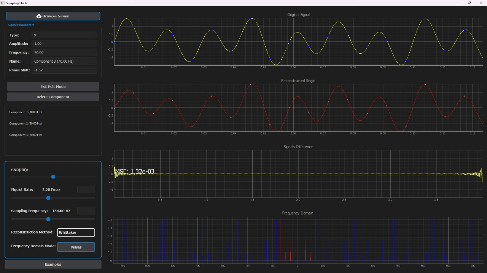

# Sampling Studio
## Introduction
Sampling an analog signal is a fundamental step in any digital signal processing system. The **Nyquist–Shannon sampling theorem** guarantees the perfect reconstruction of a signal if it is sampled at a frequency equal to or greater than twice its maximum frequency. This project explores the importance of the Nyquist rate by enabling users to sample and recover signals interactively, analyze the effects of aliasing, and experiment with different reconstruction methods.

In addition to the **Whittaker–Shannon interpolation method**, this application provides two additional reconstruction methods for comparison:
1. **Zero-Order Hold Method**: A simple method that holds each sampled value constant until the next sample.
2. **Cubic Spline Method**: A higher-order reconstruction method that provides smooth and accurate signal recovery using cubic spline interpolation.

These methods allow users to explore the strengths and weaknesses of various reconstruction techniques in different scenarios, fostering a deeper understanding of signal sampling and recovery.
## Features
- **Signal Sampling & Recovery**
  - Load a mid-length signal (approximately 1000 points) for visualization.
  - Sample the signal at user-defined frequencies and display the sampled points.
  - Reconstruct the original signal using one of the following methods:
    - **Whittaker–Shannon interpolation Method**.
    - **Zero-Order Hold Method**.
    - **Cubic Spline Method**.
  - Visualize:
    - The original signal with sampling markers.
    - The reconstructed signal.
    - The difference (error) between the original and reconstructed signals.
    - The frequency domain for aliasing analysis.
    
    *Viewing Mode*

- **Signal Mixer/Composer**
  - Users can create custom signals by mixing multiple sinusoidal components with different frequencies, magnitudes and phase shifts.
  - Add or remove sinusoidal components dynamically.
  - Ensure default values are set, so the UI is never empty.
- **Additive Noise**
  - Add noise to the signal with a custom Signal-to-Noise Ratio (SNR) level.
  - Demonstrate the dependency of noise on signal frequency.
- **Real-Time Processing**
   
   Real-time sampling and recovery with instant updates as the user modifies parameters.

  *Edit Mode*

- **Reconstruction Methods**
  Change reconstruction methods using a dropdown menu:

  - Whittaker–Shannon method.

  - Zero-Order Hold Method.

  - Cubic Spline Method.

### **Demo**
https://github.com/user-attachments/assets/0ee2c2ba-de96-4053-997c-1dd8e6c2a985


## **Setup**

- Clone the repo
```bash
git clone https://github.com/Abdelrahman0Sayed/Sampling-Theory-Studio.git
```
- Enter Project Folder
```bash
cd Sampling-Theory-Studio
```
- Install the requirements
```bash
pip install -r requirements.txt
```
- Run the Application
```bash
python SamplingStudio.py
```

## Contributors <a name = "Contributors"></a>
<table>
  <tr>
    <td align="center">
    <a href="https://github.com/Abdelrahman0Sayed" target="_black">
    
    <br />
    <sub><b>Abdelrahman Sayed Nasr</b></sub></a>
    </td>
    <td align="center">
    <a href="https://github.com/MahmoudBL83" target="_black">
    
    <br />
    <sub><b>Mahmoud Bahaa</b></sub></a>
    </td>
    <td align="center">
    <a href="https://github.com/momowalid" target="_black">
    
    <br />
    <sub><b>Mohamed Walid</b></sub></a>
    </td>
    <td align="center">
    <a href="https://github.com/Karim12Elbadwy" target="_black">
    
    <br />
    <sub><b>Kareem El-Badawi</b></sub></a>
    </td>
    <td align="center">
    <a href="https://github.com/NadaMohamedElBasel" target="_black">
    
    <br />
    <sub><b>Nada El-Basel</b></sub></a>
    </td>
      </tr>